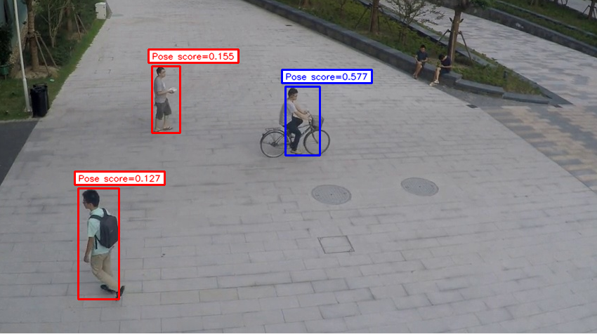

# BikeSafeAI Anomaly Detection

This repository implements a full anomaly-detection pipeline for traffic video, with emphasis on identifying unusual or potentially unsafe events involving cyclists. The system combines conventional computer vision steps with learned feature representations and probabilistic density models.

## Setting Up Your Environment

Before using this repository, you'll need to set up your environment. We recommend using Conda, a popular package and environment management system.
If you don't have Conda installed, you can download it from the Miniconda website (a minimal installer for Conda).

### Cloning the Repository

First, clone the repository to your local machine using the following command (This assumes you have Git installed from https://git-scm.com/downloads):

```bash
git clone https://github.com/imaihub/traffic-safety-anomaly-detection
cd traffic-safety-anomaly-detection
```

### Creating a Conda Environment

Once Conda is installed (from https://www.anaconda.com/download), you can create a new environment specifically for running these demos. We'll use Python 3.12 for this environment.
Open your terminal (Command Prompt on Windows, Terminal on Linux), and run the following command:

```bash
conda create -n bikesafeai python=3.12
```

### Activating the Environment

Activate the newly created environment using the command:

```bash
conda activate bikesafeai
```

###  Installing Required Packages

With the environment activated, you'll need to install the necessary Python packages. These are listed in a requirements.txt file provided in the repository.
Ensure you're in the repository's root directory in your terminal, then run:

```bash
pip install -r requirements.txt
```

## Setup script
These steps can be condensed into executing the following command if on Linux and the path to this project being correct in `setup.sh`

```bash
bash setup.sh
```

## Overview

The pipeline is organized into several stages:

### [Preprocessing](docs/preprocessing.md):

**Note:** Before running any preprocessing steps, prepare your data as described in  
[Dataset Preparation](docs/dataset_preparation.md).

Preprocessing scripts prepare the dataset for downstream tasks. This includes:

- Object detection and pose estimation using [Ultralytics YOLOv8](https://github.com/ultralytics/ultralytics)
- Optical flow estimation using [NeuFlow_v2](https://github.com/neufieldrobotics/NeuFlow_v2)

### [Feature Extraction](docs/preprocessing.md)

Three types of features are generated per detected object:

- Velocity histograms derived from optical flow [NeuFlow_v2](https://github.com/neufieldrobotics/NeuFlow_v2)
- CLIP appearance embeddings (512-D) [OpenAI CLIP](https://github.com/openai/CLIP)
- Bounding-box-normalized keypoint vectors

Each feature family is saved in a consistent directory structure for later stages.

### Density-Based Anomaly Models

Different feature types call for different estimators:

- Gaussian Mixture Models (GMM) for velocity descriptors
- FAISS k-NN for appearance and keypoint descriptors

The goal is to estimate how typical a feature vector is relative to normal training data.

### [Score Calibration](docs/training_and_calibration.md) and [Evaluation](docs/evaluation.md)

A calibration step computes global min/max ranges for each modality, ensuring that score scales are comparable.

The evaluation stage then:

- computes frame-level and object-level anomaly scores
- applies temporal smoothing
- produces ROC curves and AUCs
- saves anomaly detection results per object for the [Visualization](docs/visualization.md) step

## Quick Start

After [preparing your dataset](docs/dataset_preparation.md), [running preprocessing](docs/preprocessing.md), feature extraction, and score calibration, you can perform full anomaly detection on new videos using `inference.py`.

Example:

```bash
python core/demo/inference.py \
    --dataset-name shanghaitech \
    --gmm 5 \
    --knn 1 \
    --max-image-count-training 1000 \
    --max-image-count-testing 1000
```

| Argument                     | Default        | Description                                               |
|------------------------------|----------------|-----------------------------------------------------------|
| `--dataset-name`             | `shanghaitech` | Name of the dataset entry in `config.yml`.                |
| `--gmm`                      | `5`            | Number of Gaussian components for the velocity GMM model. |
| `--knn`                      | `1`            | k for FAISS nearest-neighbor anomaly scoring.             |
| `--max-image-count-training` | `1000`         | Number of frames to load for model calibration.           |
| `--max-image-count-testing`  | `1000`         | Number of testing frames to process.                      |

### Pipeline

- Loads test frames and precomputed training features.
- Runs YOLOv8 Pose to detect objects.
- Computes optical flow (NeuFlowV2) and extracts per-object velocity, deep, and keypoint features.
- Scores each object with GMM (velocity) and FAISS (deep + keypoints).
- Combines the scores for an overall anomaly score.
- Visualizes per-object and per-frame anomaly predictions live.
- Uses thresholds from config.yml for detection decisions. These can be changed in the script (line ~ 51) if the results are unsatisfactory

